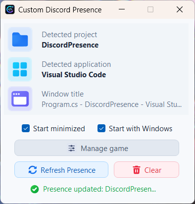
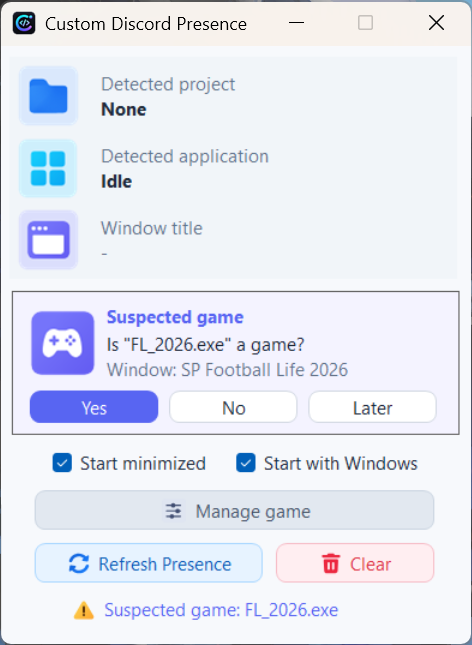
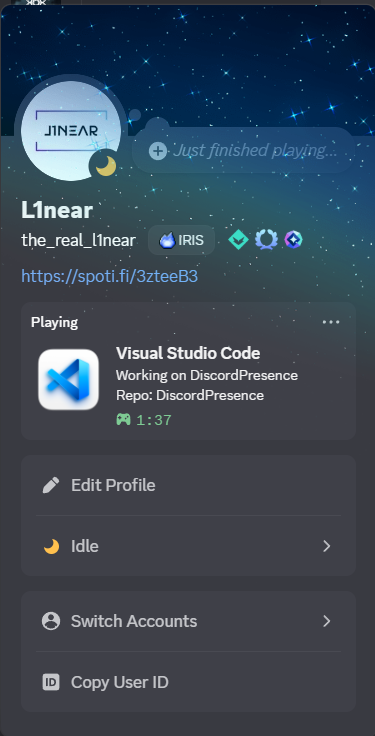
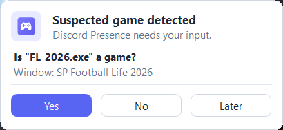
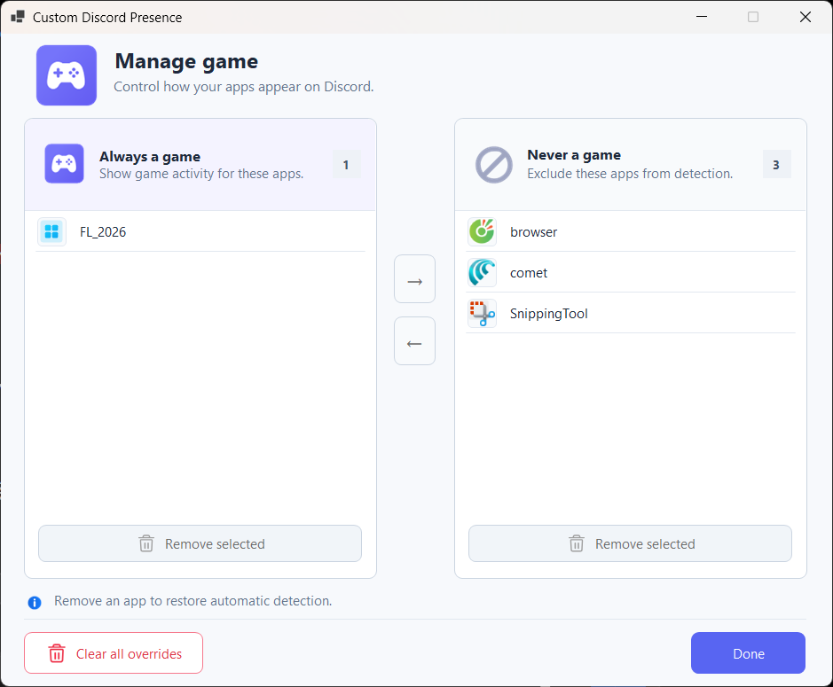

# Discord Presence

A lightweight Windows app that automatically keeps your Discord Rich Presence in sync with the development application you are currently using.

Discord Presence detects supported development tools, project names, and local Git repositories, keeps one continuous work-session timer while you move between supported apps, and gets out of the way when you start a game.

It uses the **Discord Social SDK** through a small native C++ bridge.

[](https://github.com/the-real-l1near/DiscordPresence/releases/latest)
[](https://github.com/the-real-l1near/DiscordPresence/releases/latest)
[](https://dotnet.microsoft.com/)
[](LICENSE)
[](https://github.com/the-real-l1near/DiscordPresence/issues/new?template=app-request.yml)

## Preview

<table>
  <tr>
    <th>Active</th>
    <th>Idle / suspected game</th>
  </tr>
  <tr>
    <td></td>
    <td></td>
  </tr>
</table>

### Discord result

<p align="center">
  
</p>

## Features

- Automatic foreground application detection
- Automatic project-name detection
- Automatic local Git repository detection
- Dynamic Discord activity based on the active development application
- Continuous work-session timer across supported apps and projects
- Idle presence when no supported development app is running
- Automatic Discord startup and restart recovery
- Discord Social SDK client reinitialization when needed
- Game detection using Discord's detectable-app data, user overrides, and fullscreen heuristics
- Confirmation prompt for unknown fullscreen applications instead of blindly treating them as games
- Persistent **Always a game** and **Never a game** overrides
- Temporary **Later** decision for suspected games
- Automatic suspension of custom Rich Presence while gaming
- Automatic restoration of the previous development presence after leaving a game
- System tray support
- Start minimized
- Start with Windows
- Manual presence refresh and clear
- Per-user settings stored locally
- No Discord bot token required

## Supported Applications

| Application | Process | Rich Presence asset |
| --- | --- | --- |
| Visual Studio Code | `Code.exe` | `vscode` |
| Blender | `blender.exe` | `blender` |
| Unreal Engine | `UnrealEditor.exe` | `unreal_v2` |
| IntelliJ IDEA | `idea64.exe` | `intellij` |

When no supported application is running, Discord Presence switches to the `idle_v2` asset.

Need another app? Use the **Request App Support** badge above to open an app-support request.

## How It Works

Discord Presence checks the active Windows foreground application once per second.

When a supported application is active, it builds a Discord activity from the detected application, project, repository, and current work-session start time.

For example:

```text
Visual Studio Code
Working on DiscordPresence
Repo: DiscordPresence
1:37 elapsed
```

Switching between supported applications or projects does **not** reset the work session:

```text
Visual Studio Code
→ Blender
→ Unreal Engine
→ IntelliJ IDEA
```

All of those can remain part of the same session. The timer resets after all supported development applications have closed and Discord Presence returns to Idle.

If you temporarily focus an unsupported application while a supported development app is still running, Discord Presence keeps the most recent development presence instead of replacing it immediately.

## Game Detection and Overrides

Discord Presence is designed not to fight with Discord's own game activity.

When a game becomes active, Discord Presence suspends its custom Social SDK presence so Discord can display the game's own activity. When the game loses focus or exits, the Social SDK client is restored and the previous development presence comes back with the same work-session timer.

Game classification follows this general order:

1. A user **Never a game** override wins first.
2. A user **Always a game** override is treated as a game.
3. Built-in known non-game processes are ignored.
4. Processes recognized by Discord's detectable-app data are treated as games.
5. An unknown fullscreen or borderless foreground app becomes a **suspected game** and asks the user instead of being classified automatically.

<p align="center">
  
</p>

Choosing **Yes** remembers the process as a game. Choosing **No** remembers it as a non-game. Choosing **Later** dismisses that process temporarily so it can be asked again later.

### Manage game overrides

<p align="center">
  
</p>

The override manager lets you move applications between **Always a game** and **Never a game**, remove individual decisions, or clear all overrides and return to automatic detection.

Game overrides are stored locally in:

```text
%LOCALAPPDATA%\DiscordPresence\game-overrides.json
```

## Discord Startup and Restart Recovery

Discord Presence can start before the Discord desktop client.

When Discord appears or restarts, the app reinitializes its Social SDK client and retries the current activity for a short recovery window. This allows the presence to recover automatically after Discord is closed, crashes, or restarts without requiring Discord Presence itself to be restarted.

## Discord Social SDK

Discord Presence uses the Discord Social SDK instead of the legacy Discord RPC library.

```text
DiscordPresenceService / DiscordSocialClient
                  ↓
        DiscordSocialBridge.dll
                  ↓
        discord_partner_sdk.dll
                  ↓
            Discord Desktop
```

The main application is C#. The bridge is a small native C++ library that exposes only the Social SDK functionality needed by Discord Presence.

## Installation

Download the latest installer from the [Releases](https://github.com/the-real-l1near/DiscordPresence/releases/latest) page:

```text
DiscordPresence-Setup-x.x.x.exe
```

Discord Presence is published as a **framework-dependent Windows x64 application**. The installer checks for the **Microsoft .NET 10 Desktop Runtime x64** and, if it is missing, downloads the official runtime directly from Microsoft and launches its installer automatically.

The Discord Presence application itself installs per-user and does not require administrator privileges. Windows may request elevation only if the Microsoft .NET Desktop Runtime needs to be installed.

Default installation directory:

```text
%LOCALAPPDATA%\Programs\DiscordPresence
```

The installer also allows a custom installation directory.

When upgrading an older installation, Setup clears the previous application directory before copying the new package. User settings and game overrides are kept because they live outside the installation directory under `%LOCALAPPDATA%\DiscordPresence`.

## Start with Windows

Enable **Start with Windows** from the main window.

The startup entry is stored under the current user's Windows startup registry key, so enabling it does not require administrator privileges.

If `DiscordPresence.exe` is moved manually after enabling startup, disable and re-enable **Start with Windows** so the saved executable path is refreshed.

## Local Data

Discord Presence stores user-specific data under:

```text
%LOCALAPPDATA%\DiscordPresence\
```

Current files include:

```text
settings.json
app-cache.json
game-overrides.json
```

`settings.json` currently stores the **Start minimized** preference. **Start with Windows** is managed through the Windows registry.

## Building From Source

### Requirements

- Windows 10/11 x64
- .NET 10 SDK
- Discord desktop client
- CMake
- Visual Studio 2022 Build Tools
- MSVC v143 C++ toolchain
- Windows SDK
- Inno Setup 7 if you want to build the installer

Clone the repository:

```powershell
git clone https://github.com/the-real-l1near/DiscordPresence.git
cd DiscordPresence
```

### 1. Build the native Discord Social SDK bridge

```powershell
cmake -S .\native\DiscordSocialBridge `
      -B .\native\DiscordSocialBridge\build `
      -G "Visual Studio 17 2022" `
      -A x64

cmake --build .\native\DiscordSocialBridge\build --config Release
```

The bridge is generated at:

```text
native\DiscordSocialBridge\build\Release\DiscordSocialBridge.dll
```

### 2. Build the application

```powershell
dotnet build -c Release
```

The SVG UI sources in `Assets\Icons` are converted into an embedded multi-resolution PNG resource at build time. Svg.Skia/SkiaSharp are used by the development-only icon packer and are not runtime dependencies of the published application.

### 3. Run

```powershell
dotnet run
```

### 4. Publish

```powershell
dotnet publish .\DiscordPresence.csproj `
    -c Release `
    -r win-x64 `
    --self-contained false
```

Published files are placed in:

```text
bin\Release\net10.0-windows\win-x64\publish\
```

The package includes the managed application and the native Discord Social SDK dependencies, including:

```text
DiscordPresence.exe
DiscordSocialBridge.dll
discord_partner_sdk.dll
```

## Building the Installer

Install Inno Setup 7:

```powershell
winget install --id JRSoftware.InnoSetup.7 -e
```

Then run:

```powershell
.\build-installer.ps1
```

The build script cleans previous output, builds the native Social SDK bridge, publishes the framework-dependent Windows x64 app, verifies its native dependencies, compiles the Inno Setup installer, and cleans temporary build directories.

The finished installer is placed in:

```text
dist\
```

## Project Structure

```text
DiscordPresence/
├── Assets/
│   └── Icons/                    # SVG sources packed at build time
├── installer/
│   └── DiscordPresence.iss
├── native/
│   ├── DiscordSocialBridge/      # Native C++ Social SDK bridge
│   └── sdk/                      # Discord Social SDK files
├── tools/
│   ├── GenerateEmbeddedIcons.ps1
│   └── IconPacker/
├── ActiveAppDetector.cs
├── AppCacheService.cs
├── DiscordDetectableAppService.cs
├── DiscordPresenceService.cs
├── GameDetector.cs
├── GameOverrideStore.cs
├── GameOverridesForm.cs
├── GitRepositoryDetector.cs
├── MainForm.cs
├── PresenceController.cs
├── ProjectNameDetector.cs
├── SupportedAppRegistry.cs
├── UiAssets.cs
├── UiTheme.cs
├── DiscordPresence.csproj
├── build-installer.ps1
└── icon.ico
```

## Rich Presence Assets

The Discord application currently uses these asset keys:

```text
vscode
blender
unreal_v2
intellij
idle_v2
```

If you fork the project and use a different Discord Application ID, upload matching Rich Presence assets in the Discord Developer Portal or update the asset keys and Application ID in the source.

## Privacy

Discord Presence runs locally. It reads only information needed for its features, such as running-process information, the foreground window, application window titles, and local Git repository information used for project/repository detection.

It does **not** require a Discord bot token and does **not** read or send Discord messages. Rich Presence communication is handled locally through the Discord Social SDK and the Discord desktop client.

## Notes

Project-name detection relies on application window titles, so results can vary if an application changes its title format. Git repository detection also depends on the local project/repository layout and may not identify every possible configuration.

Fullscreen detection is intentionally conservative: an unknown fullscreen application is treated as **suspected**, not automatically as a game.

## License

This project is licensed under the [MIT License](LICENSE).
